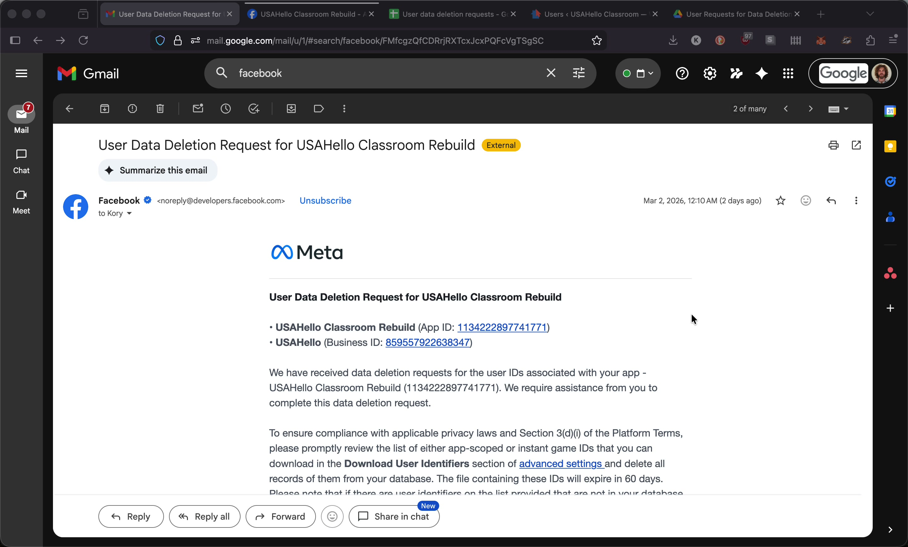
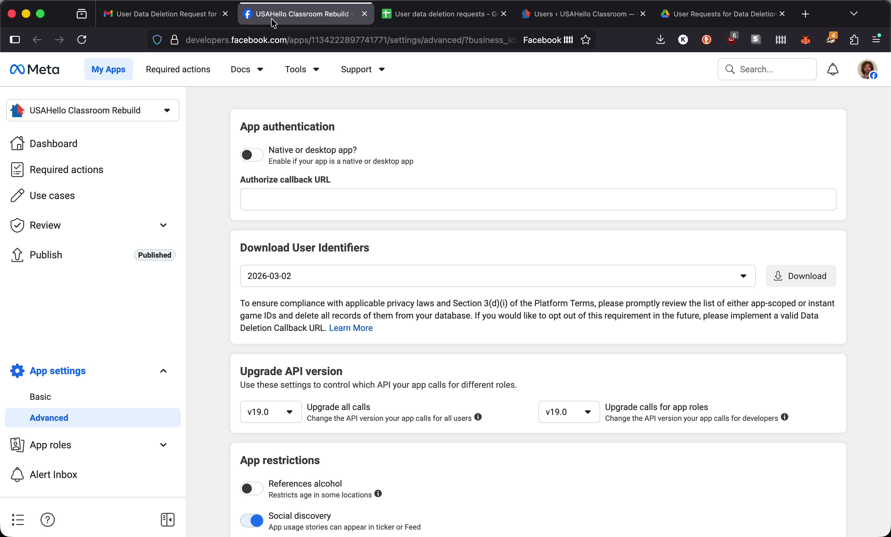
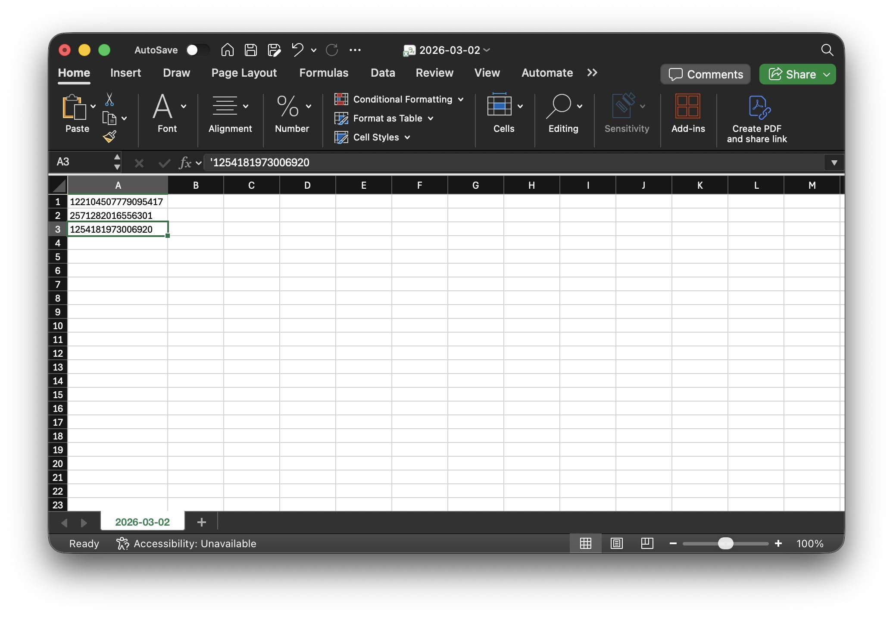
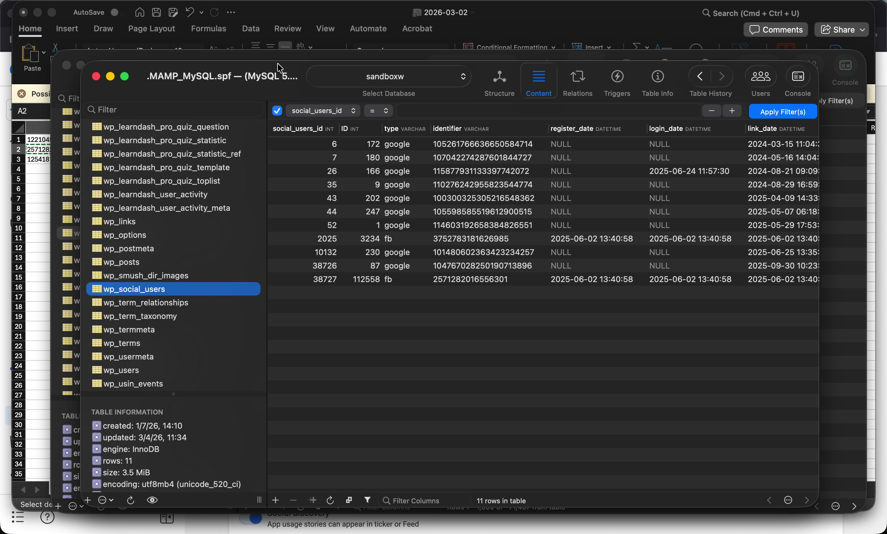
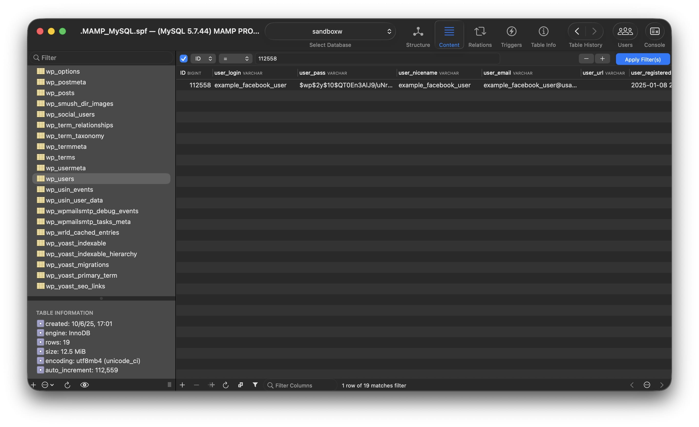
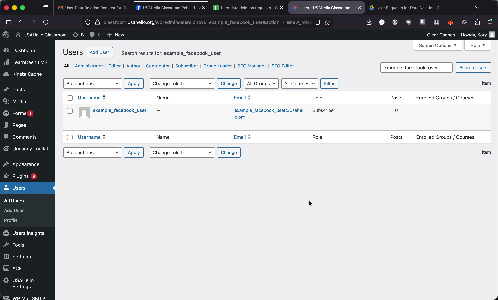
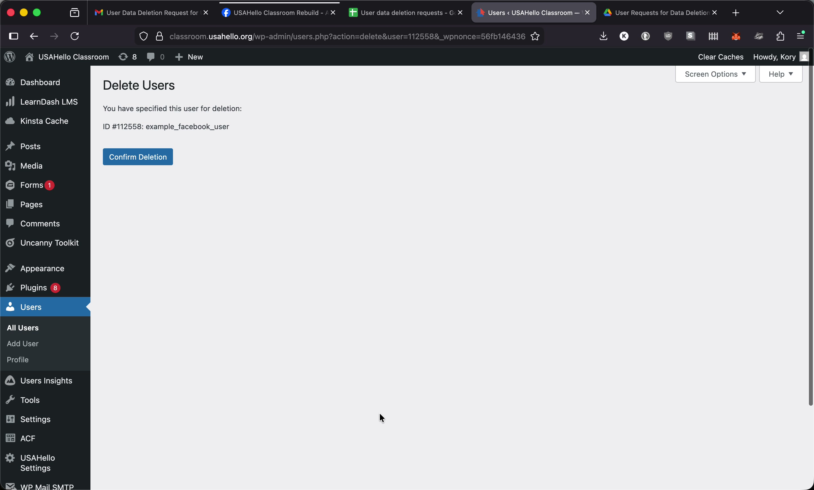
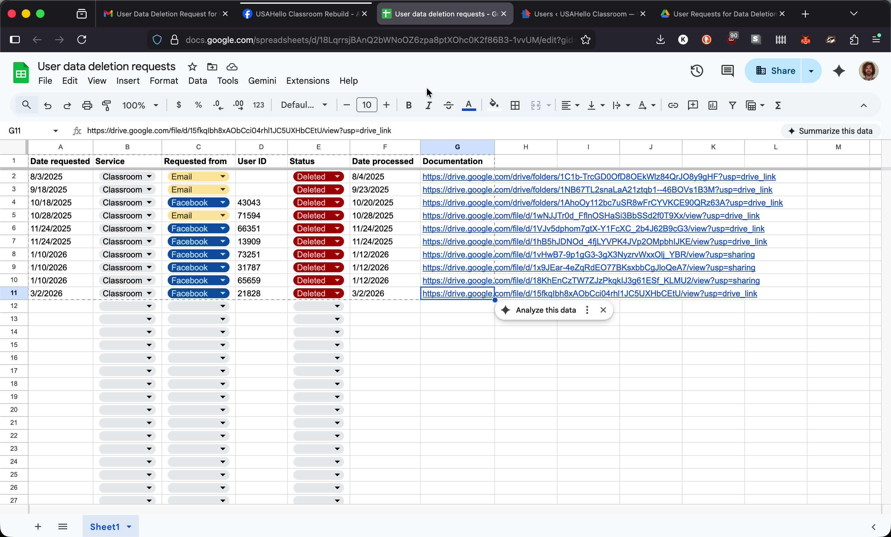

# Student User Data Deletion Requests

## Overview

When a student requests deletion of their student data it might come directly from the student to our `privacy@usahello.org` email or our `classroom@usahello.org` email, otherwise it'll be an email from Facebook/Meta. This guide walks through how to process those request: identifying the affected user, deleting them from WordPress, and recording the action in our Google Drive log.

## Step 1: Receive the Email Notification

When a deletion request comes in, you will receive an email directly from the student or from Facebook/Meta. *For data deletion requests that come directly from a student, skip to [Step 5](#step-5-delete-the-user-in-wordpress).*
<!-- add a hyperlink to Step 5 -->

## Step 2: Download User Identifiers from the Meta Developer Dashboard

Click the **Download Data** button at the bottom of the email. This opens the Meta developer dashboard.

In the **Download User Identifiers** panel near the top of the dashboard, click the **Download** button. This downloads a CSV file.

## Step 3: Review the CSV

Open the downloaded CSV file. It contains a list of numerical Facebook ID values in a single column.

> **Note:** Facebook states that not all IDs in the CSV will necessarily match a user on our website — that is expected.

## Step 4: Look Up Each ID in the Database

The Facebook login plugin uses a custom database table (`wp_social_users`) that stores Facebook identifier values alongside the corresponding WordPress user ID. Use a SQL GUI such as SQL Ace to query this table.

In the `wp_social_users` table, filter by the **identifier** column using the IDs from the CSV.

If a match is found, note the associated WordPress user ID. **Be sure to take a screenshot of the (`wp_social_users`) table filtered by the matching "identifier", you'll want to retain this for documentation purposes.**

You can then search the `wp_users` table by that ID to confirm the user record.

## Step 5: Delete the User in WordPress

Using the matched user's email address or username, search for them in the WordPress admin dashboard under **Users**.

Click the user to open their profile, then click **Delete**. WordPress will display a confirmation screen. **Take a screenshot of this screen for documentation purposes.**

Confirm the deletion.

## Step 6: Record the Request in Google Drive

All deletion requests are logged in the shared Google Drive folder. Within that folder:

1. Open the tracking sheet and add a new row with:
    - Date the request was received
    - Date it was processed
    - Status
    - Link to the documentation/screenshots

2. In the year/month subfolder, drag in the appropriate screenshots for the user:
    - The filtered `wp_social_users` table showing the matched identifier (if it's a Facebook data deletion request)
    - The delete user confirmation screen

