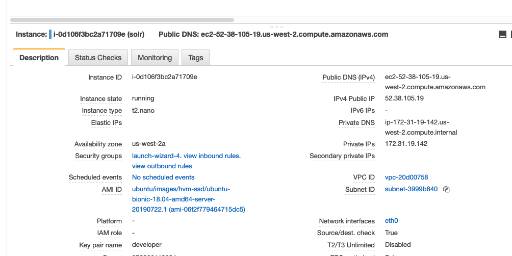
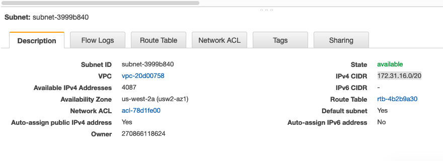
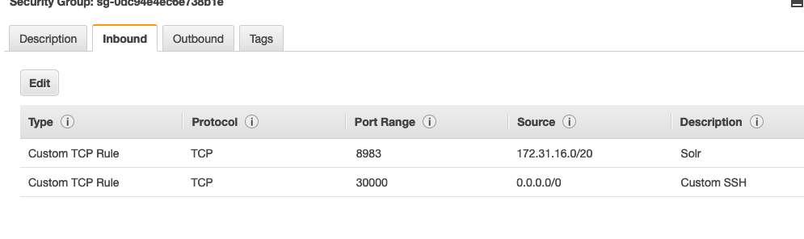

# Solr Setup

The purpose of this document is to show the steps that were initially used to set up the instanc incase it needs to be re-created at some point.

## Solr Setup

### Overview

Our EC2 instance is a `nano`/`small` Ubuntu 18.04 server running Solr `8.2.0` via Jetty. Solr is installed manually via the suggested setup steps on the Solr website:

https://lucene.apache.org/solr/guide/8_1/taking-solr-to-production.html#taking-solr-to-production

### EC2 Instance

The first thing is the EC2 instance setup. We don't want our instance available to the outside world, so the first thing to do is to lock-down the EC2 instance that Solr will be installed on.

For our Django servers and Solr to communicate, they need:

- To be in the same VPC
- Be in the same subnet (not 100% about this)

First find the instance and take note of the private IP, here `172.31.19.142`:



Then click the "subnet ID" to be brought to the relevant subnet page:



Take note of the `IPv4 CIDR` value `172.31.16.0/20`.

Then go to back to the (Solr) instance page and click on the "security group":



Hit "edit" and add a new rule that restricts connections to the subnet this instance is in. This now means that only AWS instance can communicate with our Solr instance.

#### SSH

Also note that SSH is set up on port 30000 and is publically available.

### Installation

Install Java:

```bash
sudo apt install -y default-jdk
wget http://www-eu.apache.org/dist/lucene/solr/8.2.0/solr-8.2.0.tgz
tar zxf solr-8.2.0.tgz solr-8.2.0/bin/install_solr_service.sh --strip-components=2
sudo bash ./install_solr_service.sh solr-8.2.0.tgz
```

You can start/stop and restart with

```bash
sudo service solr restart
sudo service solr stop
sudo service solr start
```

### Create a core

Add a core:

```bash
sudo -u solr /opt/solr/bin/solr create -c findhello-staging -n data_driven_schema_configs
```

This will add our new core configuration and data to `/var/solr/data/findhello-staging/`

### Generate a `schema.xml`

The schema is the file Solr uses to create its indexes. It explains what fields we want in our search documents. When we create a core, Solr adds a default schema but we need to generate one specific to our Django app. Thankfull, Haystack can do that for us.

**So back on the Django server**, run the command:

```bash
python manage.py build_solr_schema
```

This will output a schema file that you need to copy and paste to the Solr config **on the Solr instance** at `/var/solr/data/findhello-staging/conf/schema.xml`

**WARNING:** You will need to update the schema any time you make a change to the structure of our search documents (i.e. `search_indexes.py`) in Django. Haystack doesn't automatically tell Solr that the structure of our documents has changed, so you need to update the file manually and reindex/update the index.

### Create a `solrconfig.xml`

Like the schema, we also need to update the Solr settings for our core so that it's compatible with our needs. 

Get the default Haystack Solr Config from the Haystack Github page:

https://github.com/django-haystack/django-haystack/blob/master/haystack/templates/search_configuration/solrconfig.xml

and copy it the core config folder **on the Solr instance**:

```bash
sudo mv /var/solr/data/findhello-staging/conf/solrconfig.xml /var/solr/data/findhello-staging/conf/solrconfig.xml.bak
sudo vim /var/solr/data/findhello-staging/conf/solrconfig.xml
...
```

### Configure Django

Make sure your Haystack settings are correct. In you `.env`:

```
HAYSTACK_ADMIN_URL="http://172.31.19.142:8983/solr/"
HAYSTACK_URL="http://172.31.19.142/solr/findhello-staging/"
HAYSTACK_ENGINE="haystack.backends.solr_backend.SolrEngine"
```

Note that `172.31.19.142` is the **private IP** of the AWS instance with Solr installed. 

---

## Making changes to Solr

If you change your `search_indexes` in Django, you need to replace the `schema.xml` and `solrconfig.xml` mentioned above with the new versions. Ideally, you generate these files via the `manage.py build_schema_files` command from Haystack locally on your machine and then commit them to Github.

Then, take the commited files and update them on the Solr instance:

```
sudo vim /var/solr/data/findhello-staging/conf/solrconfig.xml
sudo vim /var/solr/data/findhello-staging/conf/schema.xml
```

You then need to make sure to reload the core:

```bash
curl 'http://127.0.0.1:8983/solr/admin/cores?action=RELOAD&core=findhello-staging&wt=json'
```

You should then rebuild the index **from the Django staging/production instance**

```bash
python manage.py rebuild_index
```

### Updating the index

http://docs.haystacksearch.org/en/master/searchindex_api.html#keeping-the-index-fresh

The index needs to be updated periodically:

```bash
python manage.py update_index -r
```

(Note: the inclusion of the `-r` flag ensures that the index removes any records that were deleted directly from the DB)

So we have a crontab job that does this hourly:

```bash
crontab -e
DJANGO_SETTINGS_MODULE=config.settings.production
*/5 * * * * /home/ubuntu/.venvs/find_hello/bin/python /home/ubuntu/find-hello-api/manage.py update_index -r >> /home/ubuntu/find-hello-api/logfiles/cron.out 2>&1
```

Note: it's important to include the `DJANGO_SETTINGS_MODULE` environment variable here so that cron uses the correct settings file when running the Django Haystack management command. Exclusing this was previously responsible for us missing the fact that the index wasn't being updated. 

### Accesing the admin panel

Becaues we have blocked port `:8983` to the public, we can't see the admin panel. One trick here is to perform a port-forward via SSH.

In your local `~/.ssh/config` add the following:

```
Host solr.usahello.org
    HostName 52.38.105.19
    User ubuntu
    Port 30000
    LocalForward 8001 localhost:8983
```

This will allow you to connect to the __remote__ Solr admin by accessing `http://localhost:8001` on your own machine.


---

## Troubleshooting


### Error regarding `currency.xml`

After installing the schema with Haystack, I was noticing this error:

> org.apache.solr.common.SolrException:org.apache.solr.common.SolrException: Could not load conf for core mycore: Error while parsing currency configuration file currency.xml

This is due to the default haystack schema that it generates includes fields for currency, for example:

```
<dynamicField name="*_c"   type="currency" indexed="true"  stored="true"/>
...
<fieldType name="currency" class="solr.CurrencyField" precisionStep="8" defaultCurrency="USD" currencyConfig="currency.xml" />
...
```

So delete them! Or you can add an example `currency.xml` to the core's config folder:

https://raw.githubusercontent.com/apache/lucene-solr/master/solr/example/files/conf/currency.xml

### Error regarding `QueryElevationComponent`

If you see this:

> org.apache.solr.common.SolrException:org.apache.solr.common.SolrException: Error initializing QueryElevationComponent

Delete the following from the `solrconfig.xml`:

```
<!-- Query Elevation Component

       http://wiki.apache.org/solr/QueryElevationComponent

       a search component that enables you to configure the top
       results for a given query regardless of the normal lucene
       scoring.
    -->
  <searchComponent name="elevator" class="solr.QueryElevationComponent" >
    <!-- pick a fieldType to analyze queries -->
    <str name="queryFieldType">string</str>
    <str name="config-file">elevate.xml</str>
  </searchComponent>

  <!-- A request handler for demonstrating the elevator component -->
  <requestHandler name="/elevate" class="solr.SearchHandler" startup="lazy">
    <lst name="defaults">
      <str name="echoParams">explicit</str>
    </lst>
    <arr name="last-components">
      <str>elevator</str>
    </arr>
  </requestHandler>
```
