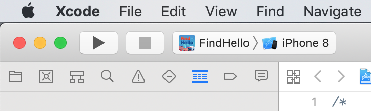

# Mobile Setup

To build the Ionic app for iOS and Android you have to have a number of dependencies installed and these can be difficult to configure correctly.

At a high level we will be using the Ionic CLIs `cordova` command to build test and release versions of the iOS and Android app. For example:

```sh
> ionic cordova build android --prod --release
```

You can use this command to create builds for development testing or production, to run the app locally on a connected phone or to run on either the Android or iOS emulator.

The following instructions are for MacOS.

## Cordova

First, make sure Cordova is installed:

```sh
npm install -g cordova
```

## Android

Instead of installing the entire Android studio we're going to install the SDK separately which gives us the tools required to build the app without the need for the entire editor. It it easier to configure and use the SDK outside of Android Studio. We need to also install the Java SDK and runtime as well as some Java build tools (primarily gradle) that Cordova will use to build the app. 

### Java 8 SDK

The first thing to install is the Java 8 JDK and runtime. For MacOS go to:

https://www.oracle.com/technetwork/java/javase/downloads/jdk8-downloads-2133151.html

and download for Mac OS X x64 ("Java SE Development Kit 8u191")

### Android build tools 

These are tools used by Cordova to build the Android app. Install the following with `brew`:

```bash
brew install gradle ant maven
```

and add these configuration variables to your shell:

```sh
vim ~/.bashrc
```

add:

```sh
# Android build tools
export GRADLE_HOME=/usr/local/opt/gradle
export ANT_HOME=/usr/local/opt/ant
export MAVEN_HOME=/usr/local/opt/maven

...
```

### Android SDK

Now install the SDK:

```sh
brew tap homebrew/cask
brew cask install android-sdk
```

Then need to now add the SDK to your path so that Cordova can find it:

```sh
vim ~/.bashrc
```

add

```sh
# Android SDK
export ANDROID_HOME=/usr/local/share/android-sdk
export PATH=$PATH:$ANDROID_HOME/emulator
export PATH=$PATH:$ANDROID_HOME/tools
export PATH=$PATH:$ANDROID_HOME/platform-tools
export PATH=$PATH:$ANDROID_HOME/bin

...
```

(Note that it's important to place the `emulator` folder above the `tools` folder to avoid problems later with emulators)

#### Troubleshooting: Issue with emulator paths

When installing the `android-sdk` it looks like it automatically symlinks a lot of the tools from the brew directory to `/usr/local/bin`. 

You can see this with:

```sh
ls -la /usr/local/bin | grep android
```

But we are already adding them to the path via our `.bashrc`.

There was an issue with the `emulator` command being linked from `/usr/local/Caskroom/android-sdk/4333796/tools/` instead of  `/usr/local/Caskroom/android-sdk/4333796/emulators/`

The easiest thing is to just delete the symlinks and allow our path changes to sort the issue:

```sh
cd /usr/local/bin
rm -rf android archquery avdmanager emulator emulator-check jobb lint mksdcard monitor monkeyrunner screenshot2 sdkmanager uiautomatorviewer
```

### Android target platform

We now need to install an Android target platform using the Android SDK:

```sh
sdkmanager "platform-tools" "platforms;android-26"
sdkmanager "build-tools;26.0.1"
```

### Cordova platform

We can now tell Cordova to set up the Android platform in our project:

```sh
ionic cordova platform add android
```

or to specify a particular version:

```sh
ionic cordova platform add android@X.X.X
```

Bear in mind that this is the `cordova-android` version, **not the android version**. You can see more here:

https://cordova.apache.org/docs/en/latest/guide/platforms/android/#requirements-and-support
https://stackoverflow.com/a/28678292/396300


### Check requirements

At this point, doing the following should show that everything is in order for Android.


```sh
ionic cordova requirements
```

- https://stackoverflow.com/a/41771566/396300

### Create a build

We should now be able to build the application for Android using:

```sh
ionic cordova build android
```

This will create a new unsigned APK (the bundle that is created by the build and that can be run directly on an Android device)

### Run on device

If you have an Android device connected to your laptop, you should be able to instruct Cordova to install and run the app automatically on the attached device using:

```sh
ionic cordova android run
```

There is also a live-reload flag that in theory allows you to make changes and have them appear in real time:

```sh
ionic cordova android run -lc
```

but it's not very reliable.

#### Environment variables when running on device

When running the app on a device (and have the API running on your machine), remember that you will have to update the `API_URL` in the `environment.ts` before running the build. You need to find the IP of the machine running the API on your local network and use this as the `API_URL`. You can use the `ifconfig` command for this. 

### Run on Emulator

You can also run the app on your machine via an emulator. First download a system image to use for emulation:

```sh
sdkmanager "system-images;android-26;google_apis;x86"
```

Create a new device:

```sh
avdmanager create avd -n test-device -k "system-images;android-26;google_apis;x86" -b x86 -c 100M -d 7 -f
```

And run it:

```sh
emulator @test-device
```

https://stackoverflow.com/questions/43275238/how-to-set-system-images-path-when-creating-an-android-avd

You can then check what's installed:

```sh
sdkmanager --list
```

You should now be able to run:

```sh
ionic cordova emulate android
```

Again, there is also a live-reload flag that in theory allows you to make changes and have them appear in real time:

```sh
ionic cordova android emulate  -lc
```

but it's not very reliable.

#### Emulator environment variables

When running the app on an emulator (and have the API running on your machine), remember that you will have to update the `API_URL` in the `environment.ts` before running the emulator. The value you should use is `10.0.2.2:8000/` which is the default IP for the emulator.

### Debugging

To debug the native Android app, you can use Chrome's remote debugging tools to connect to the webview that is running within the app on either the emulator or the device. This allows you to get access to all of the regular dev-tools that you would otherwise use to debug the web app. 

Here's a description of this process:

> [https://ionic.zone/debug/remote-debug-your-app](https://ionic.zone/debug/remote-debug-your-app)

#### Troubleshooting: Issue with Chrome remote debugging tools

Unfortunately I've noticed a problem running the remote dev tools from Chrome/Chromium that is apparently something to do with newer versions of the browser that are greater then release M63. You will notice that the dev-tools window is mostly blank and you can't use them.

**TLDR** You need an old version of Chromium to use the remote debugger properly. Here's a link to a download:

- https://commondatastorage.googleapis.com/chromium-browser-snapshots/index.html?prefix=Mac/499098/

Here is the issue discussed:

- [https://groups.google.com/forum/#!topic/google-chrome-developer-tools/qWg3OAGUIOY](https://groups.google.com/forum/#!topic/google-chrome-developer-tools/qWg3OAGUIOY)

If you need to download another version, first find the version you want (a version < 63) by looking in tags in the repo e.g `62.0.3202.0`:

- [https://chromium.googlesource.com/chromium/src/](https://chromium.googlesource.com/chromium/src/)

or just Wikipedia:

- [https://en.wikipedia.org/wiki/Google_Chrome_version_history](https://en.wikipedia.org/wiki/Google_Chrome_version_history)

Now follow the guide at the bottom to get the version:

- [https://www.chromium.org/getting-involved/download-chromium](https://www.chromium.org/getting-involved/download-chromium)

First search the version here:

- [https://omahaproxy.appspot.com/](https://omahaproxy.appspot.com/)

Which will give you a 

>  Branch Base Position: 499098 

Now look that up in the "filter box":

- https://commondatastorage.googleapis.com/chromium-browser-snapshots/index.html?prefix=Mac/499098/

#### Sharing build for testing

With Android, as long as your device is configured to run unsigned APKs, you can simply send someone the generated APK file in:

`./platforms/android/app/build/outputs/apk/debug/app-debug.apk`

The Google Play Console also has the ability to deploy test builds as part of your release strategy.

---

## iOS

Getting the iOS platform set up is much easier than Android. First, you need to make sure you are on a Mac and have Xcode installed.

### Command line tools

You need to make sure you have Xcode's "command line tools" installed:

```sh
xcode-select --install
```

### Cordova platform

We can now tell Cordova to set up the iOS platform in our project:

```sh
ionic cordova platform add ios
```

### Create a build

We should now be able to build the application for iOS using:

```sh
ionic cordova ios build
```

Unlike Android, this doesn't create an APK or bundle that can be run directly on a device. Instead it generates
an Xcode project within the `./platforms/ios/` folder that we can now open with Xcode. 

### Running and emulating

Open the Xcode project at `./platforms/ios/FindHello.xcodeproj`

This will allow you to run the application on an emulator from within Xcode, or select any physical device you have connected to your machine, and run the app on that. To do this, you just choose your destination in "FindHello > ..." from the top left button in the top bar (to the right of the play button)



Alternatively, you can try to use the `ionic cordova run ios` and `ionic cordova emulate ios` to skip Xcode, but I find this approach to be buggy and unreliable. Like Android, you can also add the `-lc` flag to try get real time live reloads, but it's also buggy.

### Sharing builds

Unlike Android, you can't simply share a build once you've built it locally. Instead, Apple require you to create an "archive" (this is the equivilant of the Android "APK"). 

Then there are two approaches to sharing builds for testing:

#### Over the air

You generate an archive and upload it to a server you control. You then set up a simple web page that can be reached from your web browser on your iOSdevice (has to be Safari). This web page tells Safari where to download the archive. Safari automatically handles this process. **We're not using this approach as it's complicated and buggy**

See more at [https://help.apple.com/deployment/ios/#/apda0e3426d7](https://help.apple.com/deployment/ios/#/apda0e3426d7)

#### Test Flight

This is an application you can download onto your iOS device that allows you to receive test builds of an application. This requires your App Store Connect account is set up.

See more at [https://blog.ionicframework.com/using-testflight-for-user-testing-with-ionic/](https://blog.ionicframework.com/using-testflight-for-user-testing-with-ionic/)
