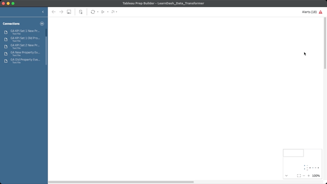
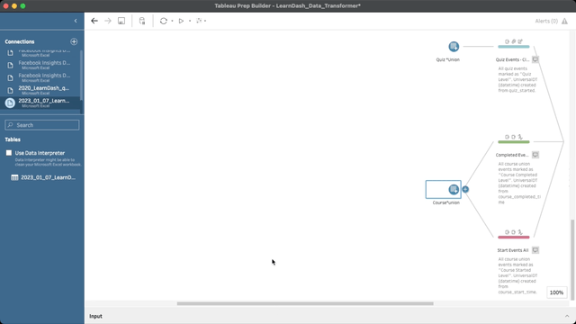
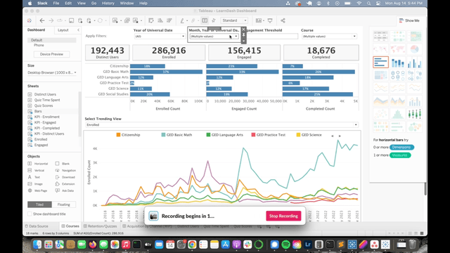
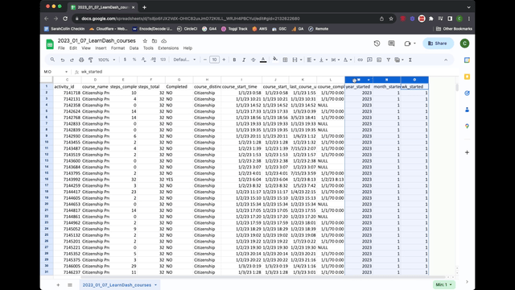

# Classroom Analytics
Classroom analytics are made up of a combination of data from the LearnDash database and Google Analytics 4.  This data is displayed in a Looker Studio dashbaord as well as a Tableau desktop dashboard. The following steps cover the monthly ETL process.

## Extracting data from LearnDash database
- Clone the Tableau repository on your local machine
``` sh
git clone https://github.com/usahello/Tableau.git
```
- Connect to LearnDash database using favorite MySQL/MariaDB GUI flavor (i.e. SequelAce)
	- IPs and Login credentials can be found in the [Kinsta dashoard](https://my.kinsta.com/) under "classroom" site info
- Open and run **course** queries located in the Tableau repositiory
	- [tableau_learnDash_courses.sql](https://github.com/usahello/Tableau/blob/cc560980a8fcb3f4ce2c58648a4d77b75e37e237/tableau_learnDash_courses.sql)
	- Update view name on [line 4](https://github.com/usahello/Tableau/blob/cc560980a8fcb3f4ce2c58648a4d77b75e37e237/tableau_learnDash_courses.sql#L4) to match previous month
	- Update date range on [line 52](https://github.com/usahello/Tableau/blob/cc560980a8fcb3f4ce2c58648a4d77b75e37e237/tableau_learnDash_courses.sql#L52) from 1/1 of current year to first day of current month and year
	- Run view query
	- Run select all query on the created view
	- Export results as .CSV file
```sh
4	CREATE VIEW `course_view_2023_01_07` AS (

52	AND from_unixtime(COALESCE(ld_course.activity_started,ld_course.activity_updated)) BETWEEN '2023-01-01 00:00:00' AND '2023-08-01 00:00:00'
```
```sh
SELECT * FROM `course_view_2023_01_07`;
```
- Open and run **quiz** queries located in the Tableau repositiory
	- [tableau_learnDash_quizzes.sql](https://github.com/usahello/Tableau/blob/cc560980a8fcb3f4ce2c58648a4d77b75e37e237/tableau_learnDash_quizzes.sql#L73)
	- Update view name on [line 4](https://github.com/usahello/Tableau/blob/cc560980a8fcb3f4ce2c58648a4d77b75e37e237/tableau_learnDash_quizzes.sql#L4) to match previous month
	- Update date range on [line 73](https://github.com/usahello/Tableau/blob/cc560980a8fcb3f4ce2c58648a4d77b75e37e237/tableau_learnDash_quizzes.sql#L73) from 1/1 of current year to first day of current month and year
	- Run view query
	- Run a select all query on the created view
	- Export results as .CSV file
```sh
4	CREATE VIEW `quiz_view_2023_01_[previous month]` AS (

73	AND from_unixtime(quiz_completed.activity_meta_value) BETWEEN '2023-01-01 00:00:00' AND '2023-08-01 00:00:00'
```
```sh
SELECT * FROM `quiz_view_2023_01_07`;
```

- Open .CSV files in MS Excel
- Save files as .XLSX in Tableua/Extract/LearnDash
- Use the following naming convention: 
	- 2023_01_07_LearnDash_courses.xlsx
	- 2023_01_07_LearnDash_quizzes.xlsx
	- Delete the previous month's files from the directory but leave the previous year files in place

## Load data into Tableau Prep Builder

Download [Tableua Prep Builder](https://www.tableau.com/products/prep) and Tableua Desktop

- Licenses obtained through TechSoup Request ID #2681660

Open [LearnDash_Data_Transformer.tfl](https://github.com/usahello/Tableau/blob/cc560980a8fcb3f4ce2c58648a4d77b75e37e237/LearnDash_Data_Transformer.tfl) using Tableua Prep builder

- In the Connections list on the top left of the screen, scroll down to the previous month's file
- Click the arrow and select Edit
- Select the new month's file
- The flow should update and clear any errors, you can view this in the top right corner




- Scroll to the right of the flow and click the play button next to the "Master" icon
- When prompted, select "Replace" to overwrite the existing file



## Load Dashboard in Tableau Desktop

Open [LearnDash_Dashboard.tfl](https://github.com/usahello/Tableau/blob/cc560980a8fcb3f4ce2c58648a4d77b75e37e237/LearnDash%20
Dashboard.twb) using Tabelaue Desktop

- Select "Month, Year of Universal Date" dropdown menu and select previous month
- Double check that previous month data is in the graph
- Select File > Export Packaged Workbook
- Save workbook in Tableau/read/
- Save as "2018_0101_2023_0731_LearnDash_Dashboard.twbx"
- Upload file to [Google Drive](https://drive.google.com/drive/folders/1Txq1Lk1huRqMNsXVwcQuuX2LwgSZkB3H?usp=drive_link)




## Import Data into Google Drive

Import courses excel file (2023_01_07_LearnDash_courses.xlsx) into [Google Drive](https://drive.google.com/drive/folders/1Zjb3V6-xx3W9_QgWFocy4__kdpVKXE6_?usp=drive_link)

- Add 3 new columns to the end of the file
	- start_date
	- updated_date
	- universal_date
- Set start_date = column I
- Set updated_date = column K
- Insert the following formula into column R (universal_date)
```sh
=IF(AND(Q2<>"NULL",Q2<>"1970-01-01",Q2>P2),Q2,P2)
```


## Update Looker Studio

Open [Looker Studio Dashboard](https://lookerstudio.google.com/reporting/5b1695df-06f0-49a9-a207-cb0e1e2558df)

- Navigate to the Classroom page in the dashboard (page 6) and update the following
- Active Students scorecard
	- Delete data source and import new file from Google Drive
	- Date Range Dimension = universal_date
	- Metric = Record Count
- Blend Total Users and Active Students to create % Active 
- GED Enrollments
	- Replace data source with current file
	- Date Range Dimension = start_date
	- Metric = Record Count
	- Filter = LD GED
- Citizenship Enrollments
	- Replace data source with current file
	- Date Range Dimension = start_date
	- Metric = Record Count
	- Filter = LD Citz
- Enrollment Table
	- Replace data source with current file
	- Date Range Dimension = start_date
	- Dimensions = course_distinction + Language (course_id)
	- Metric = Record Count
	- Filter = LD Citz
- GED Completed Courses
	- Replace data source with current file
	- Date Range Dimension = universal_date
	- Metric = Record Count
	- Filter = LD GED + LD Completed filter
- Citizenship Completed Courses
	- Replace data source with current file
	- Date Range Dimension = universal_date
	- Metric = Record Count
	- Filter = LD Citz + LD Completed filter
- YTD Active Students
	- Replace data source with current file
	- Dimension = universal_date
	- Metric = Record Count
	- Filter = LD Citz

<iframe width="560" height="315" src="https://www.youtube.com/embed/-kmYZTFAJ2g" title="YouTube video player" frameborder="0" allow="accelerometer; autoplay; clipboard-write; encrypted-media; gyroscope; picture-in-picture; web-share" allowfullscreen></iframe>