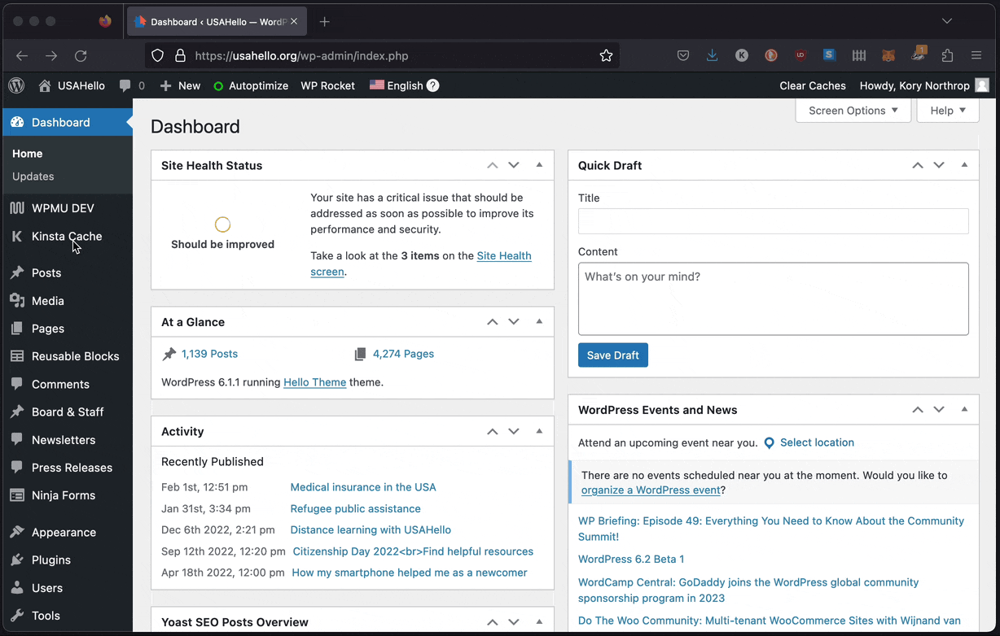
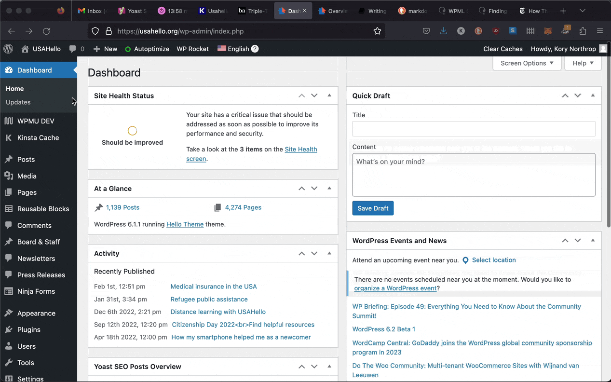
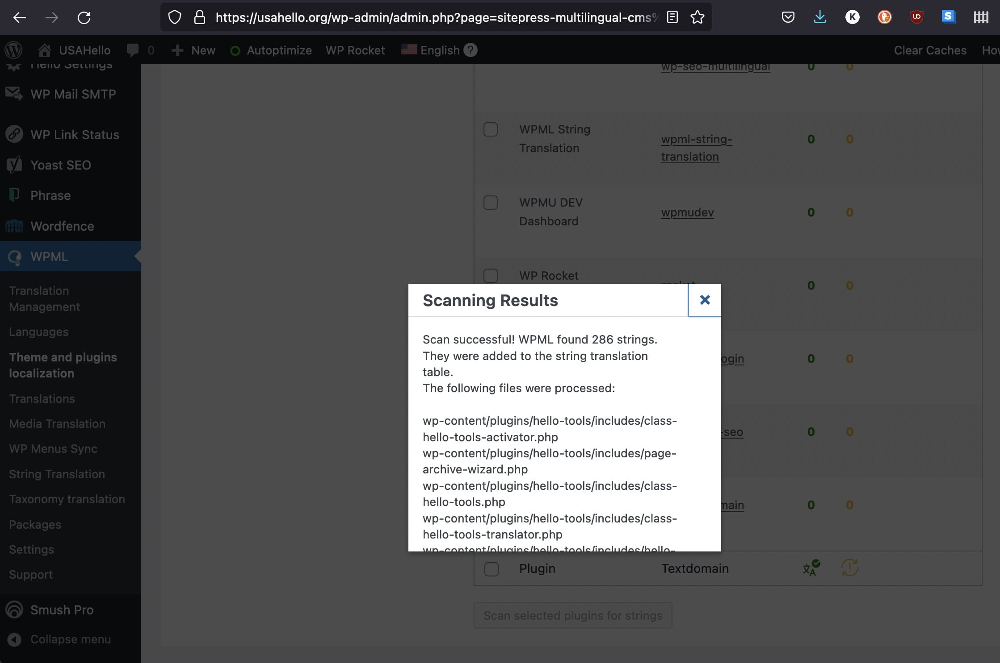

# String translations

Some words and sentences are built directly into our website code and aren't editable by our Content Team (e.g. the newsletter signup in the footer has a text string that says, _"Sign up for our newsletter!"_). These strings need to be edited by a developer in the source code using [i18n standards](https://codex.wordpress.org/I18n_for_WordPress_Developers#Strings_for_Translation "Strings for translation") so that WPML can recognize them as strings available for translation. We utilize WPML's String Translation dashboard ([WPML > String Translation](https://usahello.org/wp-admin/admin.php?page=wpml-string-translation/menu/string-translation.php "WPML String Translation dashboard")) to edit the translations because it is easier for our non-technical staff to participate as opposed to using .po/.mo files that get translated offline and uploaded to the website.

## Editing existing string translations

1. Go to WPML > String Translation
2. You can use the domain filter to only display USAHello's strings, choose our theme (_hellotheme_) or plugin (_hello-tools_) if desired. You can also just use the search field and paste in part or all of the string you want to translate.
3. Once you find the desired string, use the + and pencil icons to add a new translation or update an existing one.
4. You can save your translation by hitting the Enter or Tab keys on your keyboard or simply clicking out of the window. The Tab key allows you to switch between languages without having to click.

Note: there are a few strings that are updated in the admin area of Wordpress (e.g. the News Alert link text) that do _not_ show up associated with our theme domain (_hellotheme_) or plugin domain (_hello-tools_). They have a separate domain and should all be near the top of the dropdown list beginning with "_admin_texts_hello_".

More information about string translation can be found in [WPML's String Translation documentation](https://wpml.org/documentation/getting-started-guide/string-translation/ "WPML String Translation")

## Registering new string translations

If new strings were added to our USAHello theme or plugin (e.g. we built a new feature with default text or changed an existing one) they will need to be registered by WPML so they can be translated. After the code changes are pushed to the production server do the following:

1. Go to "WPML → Theme and plugins localization"
2. Select our custom theme (Hello Theme) or plugin (Hello Tools) from the domains dropdown list and click to scan it.
3. This process will take a few minutes and once it finishes you should see a success message similar to the one below. You will now be able to find the new strings on the WPML String Translation page:

If you're having trouble finding specific strings you can refer to [WPML's Finding Strings documentation](https://wpml.org/documentation/getting-started-guide/string-translation/finding-strings-that-dont-appear-on-the-string-translation-page/ "WPML String Translation Docs") for further guidance.